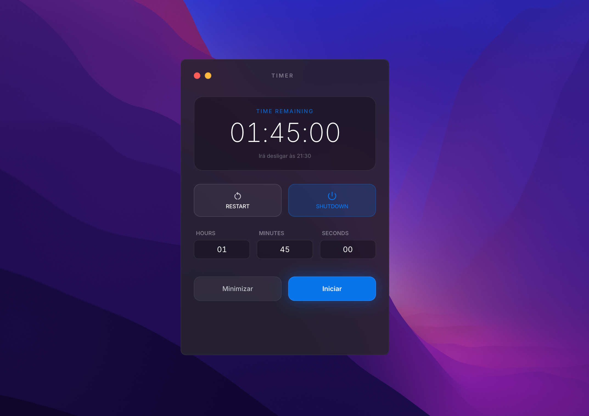

#  Shutdown Timer Widget

Um widget timer flutuante, elegante e minimalista para macOS, Windows e Linux, desenhado com estilo nativo (glassmorphism/translucidez) para agendar o desligamento do computador.

🌐 **Languages / Idiomas**:
- [Português (Brasil)](README.md)
- [English](README.en.md)
- [Español](README.es.md)


[](https://github.com/arjosweb/shutdown-timer-widget)




## Funcionalidades

- **Design Premium**: Interface moderna com efeito de vidro (blur), transparência e bordas suaves.
- **Multiplataforma**: Suporte nativo para macOS. Versões Windows e Linux em estágio *(Beta)*.
- **Timer Visual**: Contagem regressiva clara com hora estimada de desligamento.
- **Controles**: Iniciar, Parar, Reiniciar e Desligar Agora.
- **Inputs Livres**: Defina horas, minutos e segundos conforme necessário.
- **Notificações**: Aviso de sistema antes do desligamento.
- **Seguro**: Executa o comando de desligamento nativo de cada sistema operacional.

## Pré-requisitos

- macOS, Windows ou Linux.
- Node.js instalados.

## Instalação

1. Clone o repositório:
   ```bash
   git clone https://github.com/arjosweb/shutdown-timer-widget.git
   ```
2. Instale as dependências:
   ```bash
   npm install
   ```

## Como Rodar (Desenvolvimento)

Para iniciar o widget em modo de desenvolvimento:

```bash
npm start
```

> **Nota sobre Permissões**: Ao clicar em "Iniciar" ou "Shutdown", o sistema pode solicitar sua senha de administrador ou permissão de superusuário. Isso é necessário para executar o comando de desligamento do sistema operacional.

## Como Gerar os Executáveis (Build)

Para gerar as versões de distribuição para diferentes plataformas:

- **macOS (.dmg)**:
  ```bash
  npm run pack:mac
  ```
- **Windows (.exe portable)**: *(Beta)*
  ```bash
  npm run pack:win
  ```
- **Linux (AppImage / .deb)**: *(Beta)*
  ```bash
  npm run pack:linux
  ```
- **Todas as Plataformas**:
  ```bash
  npm run pack:all
  ```

Os arquivos gerados estarão na pasta `dist/`.

## Gerar Releases Zipados

Para gerar builds de macOS, Linux e Windows e organizar os arquivos zipados por plataforma:

```bash
npm run release:zip
```

O script executa:
- build multiplataforma (`npm run pack:all`);
- filtro de artefatos em `dist/` (`.dmg`, `.AppImage`, `.exe`);
- criação de um `.zip` por artefato;
- organização final em `downloads/`.

Estrutura de saída esperada:

```text
downloads/
  macos/
    <arquivo>.dmg.zip
  linux/
    <arquivo>.AppImage.zip
  windows/
    <arquivo>.exe.zip
```

Observações:
- Em macOS, gerar artefatos de Windows/Linux pode depender de toolchain adicional de cross-build.
- Se você já tiver artefatos em `dist/` e quiser só zipar sem rebuild, execute:
  ```bash
  bash ./scripts/build-release-zips.sh --no-build
  ```

## Estrutura do Projeto

- `src/main.ts`: Processo principal Electron, gerencia a janela e eventos de sistema.
- `src/services/`: Lógica de timer e integração com os comandos de cada sistema (`shutdownService.ts`).
- `renderer/`: Interface do usuário (HTML/CSS).
- `src/renderer/`: Lógica da interface em TypeScript.

---

## Desenvolvido por

**Artur Medeiros (ARJOS Tech)**
- **Email**: [contato@arjos.com.br](mailto:contato@arjos.com.br)
- **GitHub**: [arjosweb](https://github.com/arjosweb)

Este projeto é **Open Source** sob a licença [MIT](LICENSE).
